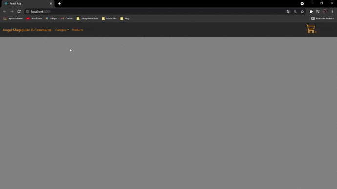

# Magaquian E-Commerce

Proyecto construido con Create React App.

## `Get Started`:

Este proyecto esta desarrollado con React, por lo que es necesario configurar el entorno:

-Instalar y configurar `node` haciendo [Click Aquí](https://nodejs.org/en/). Se peude verificar la instalación con el comando `npm -v` en el CLI.

-Una vez instalado node, podemos clonar del repositorio el proyecto y abrirlo en nuestro editor de codigo.

-Ejecutar en CLI el comando `npm install`.

-Para poder ejecutar la aplicación en modo desarrollo, escribir en el `CLI`  el comando `npm start`, la app se abrira en el browser en  [http://localhost:3000](http://localhost:3000).

-La pagina se actualizara si se guarda algún cambio. Tambien podrás ver cada linea de error en la consola.

## `Sobre el proyecto`

>Magaquian E-commerce es un proyecto de desarrollo donde se empleó mayor mente `Java Script` (`React` y `JSX`), `Bootstrap`, `css` y `firebase`.
La finalidad de este desarrollo es demostrar mi experiencia y conocimiento adquirido con React creando una app basica
de compra de articulos electronicos siguiendo los pasos y desafios brindados por CoderHouse.

Actualmente el proyecto se encuentra en la version 0.1.0, a pesar de las multiples entregas, cuenta con la minima navegabilidad para poder realizar el proceso
de seleccionar uno o varios productos de distintas categorias, visualizar los productos a comprar en un carrito y proceder a la orden de compra de esos productos y
donde el usuario coloca algunos datos personales, todo guardandolo en firebase.

<!-- ## `Versiones`
-`React`: ^17.0.2

-`firebase`: ^8.7.1

-`Bootstrap`: ^5.0.1

-`npm`: 7.13.0
 -->

## `Repositorio`

El repositorio que se usa actualmente es GitHub donde se encuentra la ultima versión actualizada con commits en el branch master. El proyecto es de caracter público por lo que puede ser clonado por cualquier usuario.

Para ingresar al repositorio hace [Click Aquí](hhttps://github.com/AngelMagaquian/CoderHouse/tree/master/magaquianecommerce)